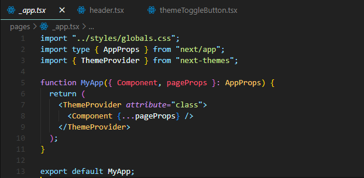

# Next Portfolio

기술 스택 (Front): Next.js React TypeScript TailwindCSS BootStrapIcon LottieFilesAnimation 
깃허브 링크: https://github.com/umsungjun/Next-Portfolio 
배포 링크: https://next-portfolio-puce-kappa.vercel.app/ 
주제: 포트폴리오를 봐주시는 인사담당자분들을 위해서 SEO에 최적화된 웹 애플리케이션으로, NEXT.js와 TypeScript를 사용하여 개발 한 포트폴리오입니다. 
진행 기간: 2023년 6월 1일 → 2023년 6월 4일 
프로젝트 종류: 개인프로젝트 

## 프로젝트 소개

포트폴리오 프로젝트는 SEO에 최적화된 웹 애플리케이션으로, NEXT.js와 TypeScript를 사용하여 개발하였습니다. TypeScript를 도입하여 정적 타입 검사를 수행하여 코드의 안정성과 가독성을 높였습니다.

이 프로젝트를 통해 저는 최신의 웹 개발 동향에 대한 이해와 SEO에 대한 경험을 쌓았습니다. 또한, NEXT.js와 TypeScript와 같은 인기 있는 기술 스택을 활용하여 효율적이고 유지보수가 용이한 코드를 작성하는 방법을 익혔습니다.

포트폴리오를 검토하시는 인사담당자 분들께서는 이 프로젝트를 통해 제가 웹 개발에 필요한 기술과 실무적인 경험을 가지고 있다는 것을 확인하실 수 있을 것입니다.

## 기능 구현

### Light / Dark 테마

- 기능 소개 : Header의 Theme 버튼(아이콘)을 통해서 Light 또는 Dark 테마를 적용할 수 있습니다.
- 기능 구현 : MyApp 컴포넌트는 AppProps를 매개변수로 받고, ThemeProvider 컴포넌트로 감싸져 있습니다. ThemeProvider는 "class"라는 속성을 가지며, 클래스를 사용하여 테마를 전환할 수 있게 합니다. 헤더에는 themeToggleButton 컴포넌트가 있습니다. 이 컴포넌트는 버튼을 렌더링하며, 버튼을 클릭하면 useTheme 함수를 사용하여 테마를 토글할 수 있습니다. 만약 현재 테마가 "light"이면 "dark"로, "dark"이면 "light"로 테마가 전환됩니다.

  

 

### Notion API를 사용한 프로젝트 목록 가져오기 기능

- 기능 소개 : Notion API를 사용하여 데이터를 파싱하고 프로젝트 목록을 표시하는 기능을 구현했습니다
- 기능 구현 : postman을 통해 API 통신을 확인한 후, 초기에는 getServerSideProps()를 사용하여 데이터 통신을 구현하였으나 배포 후 페이지 변경이 많지 않을 것으로 판단하여 성능 향상을 위해 getStaticProps()를 사용하였습니다. 데이터는 types 폴더에 따로 정의된 Repo와 ProjectItem 타입을 사용하여 파싱하였고, Projects 컴포넌트에서는 받아온 데이터를 랜더링하는 로직을 구현하였습니다.

  

 

 

 

## 이슈

### 이슈 1

- 이슈 : React 프레임워크에서는 일반적으로 **``** 태그를 사용할 때 문제가 없었지만 Next.js에서는 다른 방식으로 이미지 처리를 해야 했습니다.
- 해결 방법 : Next.js에서는 내장된 Image 컴포넌트를 사용하여 이미지를 처리하기 때문에 next.config.js 파일에 이미지 도메인 출처를 등록하니 오류가 발생하지 않았습니다. 이때 왜 Next.js의 Image 컴포넌트를 사용할까라는 의문이 생겼는데 그 이유는 이미지의 출처(도메인)를 next.config.js 파일의 images 설정에 등록함으로써 보안 및 성능 측면에서 더욱 안전하고 최적화된 이미지를 제공하기 때문이란 걸 알게 되었습니다.

  

### 이슈 2

- 이슈 : getStaticProps()와 getServerSideProps() 함수 중 어떤 것을 사용해야 할지에 대한 고민이 있었습니다.
- 해결 방법 : 처음에는 수정된 데이터를 실시간으로 확인하기 위해 getServerSideProps() 함수를 사용했으나, 배포 후에 더 나은 성능을 제공하기 위해 getStaticProps() 함수를 사용하는 방법을 선택했습니다.

 
